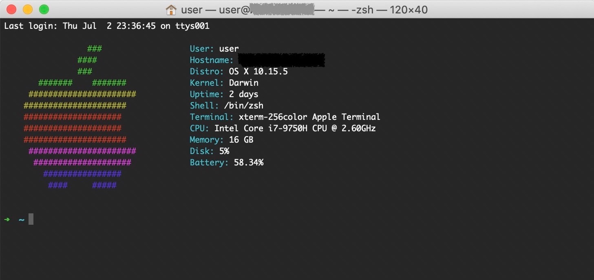
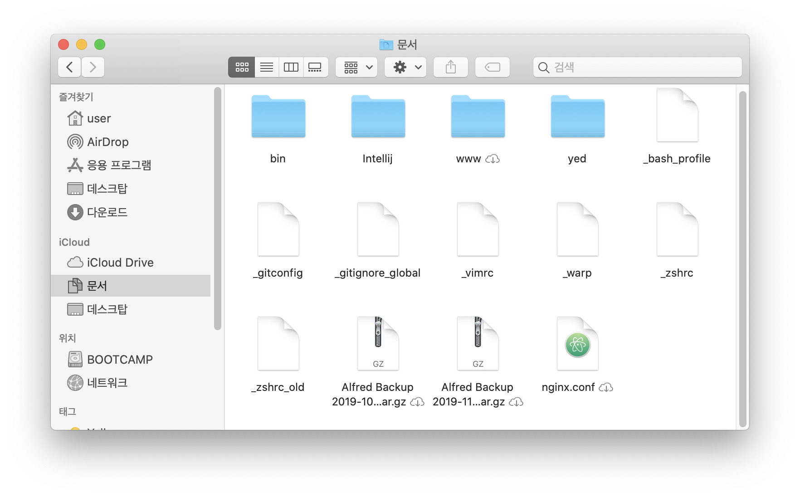
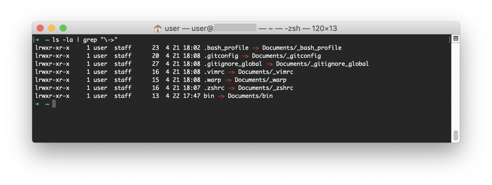

Mac은 brew와 같은 CLI 기반의 패키지 관리 도구 덕분에 개발환경을 구축하기 편합니다. 여기에 iCloud를 사용하면 로컬 환경을 간편하게 클라우드 환경으로 옮겨놓을 수 있습니다.

## 출발하기

### brew 설치

Mac이나 Linux로 개발하다가 Windows 환경을 다시 못돌아가는 이유가 2가지 있는데, 하나는 터미널이고 나머지 하나가 패키지 관리자입니다. 터미널은 Windows에서 PowerShell을 지원하면서~~맘에는 안들지만~~ 어느 정도 해결은 되었는데, Windows에선 아직 쓸만한 패키지 관리자를 보진 못했습니다.



레드햇 리눅스에서는 rpm에서 업그레이드 된 yum을 사용하고, 데비안 계열의 우분투 리눅스에서는 dpkg에서 업그레이드 된 apt를 사용합니다. 리눅스에서는 [port](https://www.macports.org/)와 [brew](https://brew.sh/) 2가지 선택지가 있는데, 둘의 차이는 소스를 직접 빌드하거나 혹은 이미 빌드된 바이너리를 그냥 받느냐입니다. yum, apt와 마찬가지고 그냥 바이너리를 다운받는 brew가 빠르고 더 편리합니다.

```shell
$ /bin/bash -c "$(curl -fsSL https://raw.githubusercontent.com/Homebrew/install/master/install.sh)"
```

### zsh 환경 구축

Mac은 Catalina 이후로 기본쉘이 `bash`에서 `zsh`로 변경[^1] 되었습니다. 뭐 이것 때문은 아니라도 zsh이 bash 보다 UI, 편의성 면에서 더 좋기 때문에 첨부터 zsh로 사용하는 것도 좋을 듯 합니다.

1. zsh 설치
    ```shell
    brew install zsh
    ```
1. oh-my-zsh 설치
    ```shell
    sh -c "$(curl -fsSL https://raw.github.com/robbyrussell/oh-my-zsh/master/tools/install.sh)"
    ```
1. `.zshrc` 설정 (뒤에 후술할 nvm, rbenv 등 모든 정보 포함)
    ```shell
    # If you come from bash you might have to change your $PATH.
    export PATH=$HOME/bin:/usr/local/bin:$PATH
    
    # Path to your oh-my-zsh installation.
    export ZSH="/Users/user/.oh-my-zsh"
    
    # Set name of the theme to load --- if set to "random", it will
    # load a random theme each time oh-my-zsh is loaded, in which case,
    # to know which specific one was loaded, run: echo $RANDOM_THEME
    # See https://github.com/robbyrussell/oh-my-zsh/wiki/Themes
    ZSH_THEME="robbyrussell"
    
    # Set list of themes to pick from when loading at random
    # Setting this variable when ZSH_THEME=random will cause zsh to load
    # a theme from this variable instead of looking in ~/.oh-my-zsh/themes/
    # If set to an empty array, this variable will have no effect.
    # ZSH_THEME_RANDOM_CANDIDATES=( "robbyrussell" "agnoster" )
    
    # Uncomment the following line to use case-sensitive completion.
    # CASE_SENSITIVE="true"
    
    # Uncomment the following line to use hyphen-insensitive completion.
    # Case-sensitive completion must be off. _ and - will be interchangeable.
    # HYPHEN_INSENSITIVE="true"
    
    # Uncomment the following line to disable bi-weekly auto-update checks.
    # DISABLE_AUTO_UPDATE="true"
    
    # Uncomment the following line to automatically update without prompting.
    # DISABLE_UPDATE_PROMPT="true"
    
    # Uncomment the following line to change how often to auto-update (in days).
    # export UPDATE_ZSH_DAYS=13
    
    # Uncomment the following line if pasting URLs and other text is messed up.
    # DISABLE_MAGIC_FUNCTIONS=true
    
    # Uncomment the following line to disable colors in ls.
    # DISABLE_LS_COLORS="true"
    
    # Uncomment the following line to disable auto-setting terminal title.
    # DISABLE_AUTO_TITLE="true"
    
    # Uncomment the following line to enable command auto-correction.
    # ENABLE_CORRECTION="true"
    
    # Uncomment the following line to display red dots whilst waiting for completion.
    # COMPLETION_WAITING_DOTS="true"
    
    # Uncomment the following line if you want to disable marking untracked files
    # under VCS as dirty. This makes repository status check for large repositories
    # much, much faster.
    # DISABLE_UNTRACKED_FILES_DIRTY="true"
    
    # Uncomment the following line if you want to change the command execution time
    # stamp shown in the history command output.
    # You can set one of the optional three formats:
    # "mm/dd/yyyy"|"dd.mm.yyyy"|"yyyy-mm-dd"
    # or set a custom format using the strftime function format specifications,
    # see 'man strftime' for details.
    # HIST_STAMPS="mm/dd/yyyy"
    
    # Would you like to use another custom folder than $ZSH/custom?
    # ZSH_CUSTOM=/path/to/new-custom-folder
    
    # Which plugins would you like to load?
    # Standard plugins can be found in ~/.oh-my-zsh/plugins/*
    # Custom plugins may be added to ~/.oh-my-zsh/custom/plugins/
    # Example format: plugins=(rails git textmate ruby lighthouse)
    # Add wisely, as too many plugins slow down shell startup.
    plugins=(git)
    
    source $ZSH/oh-my-zsh.sh
    
    # User configuration
    
    # export MANPATH="/usr/local/man:$MANPATH"
    
    # You may need to manually set your language environment
    # export LANG=en_US.UTF-8
    
    # Preferred editor for local and remote sessions
    # if [[ -n $SSH_CONNECTION ]]; then
    #   export EDITOR='vim'
    # else
    #   export EDITOR='mvim'
    # fi
    
    # Compilation flags
    # export ARCHFLAGS="-arch x86_64"
    
    # Set personal aliases, overriding those provided by oh-my-zsh libs,
    # plugins, and themes. Aliases can be placed here, though oh-my-zsh
    # users are encouraged to define aliases within the ZSH_CUSTOM folder.
    # For a full list of active aliases, run `alias`.
    #
    # Example aliases
    # alias zshconfig="mate ~/.zshrc"
    # alias ohmyzsh="mate ~/.oh-my-zsh"
    alias tree='tree -CNFh --du'
    
    # Archey
    if [ -f "/usr/local/bin/archey" ]; then
      archey -c -o
    fi
    export PATH="/usr/local/sbin:$PATH"
 
    # Java Version Environment
    if which jenv > /dev/null; then eval "$(jenv init -)"; fi
   
    # Python Environment
    eval "$(pyenv init -)"
    eval "$(pyenv virtualenv-init -)"
    
    # Node Version Manager
    export NVM_DIR="$HOME/.nvm"
    [ -s "/usr/local/opt/nvm/nvm.sh" ] && . "/usr/local/opt/nvm/nvm.sh"  # This loads nvm
    [ -s "/usr/local/opt/nvm/etc/bash_completion.d/nvm" ] && . "/usr/local/opt/nvm/etc/bash_completion.d/nvm"  # This loads nvm bash_completion
    
    # Ruby Version Manager
    [[ -d ~/.rbenv  ]] && \
      export PATH=${HOME}/.rbenv/bin:${PATH} && \
      eval "$(rbenv init -)"
    ```

## 개발 환경

나는 Java 백엔드 개발자이고 취미로 하는 코딩은 Python을 사용합니다. NodeJS와 Ruby의 경우에는 오픈소스 라이브러리들이 종종 필요로 하기 때문에 설치합니다. 둘 다 `brew`로 직접 설치해도 무방한데, 가끔 호환성 문제와 같이 특정 버전을 요구하는 경우가 있어 version manager 형태로 설치하는게 좋습니다.

### Java

Java는 크게 두 가지 방법으로 설치합니다. `brew`를 이용하면 Open JDK를 설치하고, Oracle JDK를 설치하려면 [다운로드](https://www.oracle.com/technetwork/java/javase/downloads/jdk12-downloads-5295953.html) 후 설치합니다.

1. Open JDK 설치
    ```shell
    $ brew cask install java
    ```
1. jenv 설치
    ```shell
    $ brew install jenv
    ```
1. `.zshrc` 설정 추가
    ```shell
    # Java Version Environment
    if which jenv > /dev/null; then eval "$(jenv init -)"; fi
    ```
1. 코드 반영
    ```shell
    $ source ~/.zshrc
    ```

### Python

1. python, pyenv[^2] 설치
    ```shell
    $ brew install python pyenv
    ```
1. `.zshrc` 설정 추가
    ```shell
    # Python Environment
    eval "$(pyenv init -)"
    eval "$(pyenv virtualenv-init -)"
    ```
1. 코드 반영
    ```shell
    $ source ~/.zshrc
    ```

### NodeJS

1. nvm[^3] 설치
    ```shell
    $ brew install nvm
    ```
1. `.zshrc` 설정 추가
    ```shell
    # Node Version Manager
        export NVM_DIR="$HOME/.nvm"
        [ -s "/usr/local/opt/nvm/nvm.sh" ] && . "/usr/local/opt/nvm/nvm.sh"  # This loads nvm
        [ -s "/usr/local/opt/nvm/etc/bash_completion.d/nvm" ] && . "/usr/local/opt/nvm/etc/bash_completion.d/nvm"  # This loads nvm bash_completion
    ```
1. 코드 반영
    ```shell
    $ source ~/.zshrc
    ```

### Ruby

1. rbenv[^4] 설치
    ```shell
    $ brew install rbenv ruby-build
    ```
1. `.zshrc` 설정 추가
    ```shell
    # Ruby Version Manager
        [[ -d ~/.rbenv  ]] && \
          export PATH=${HOME}/.rbenv/bin:${PATH} && \
          eval "$(rbenv init -)"
    ```
1. 코드 반영
    ```shell
    $ source ~/.zshrc
    ```
1. 최신 ruby 버전 확인 & 설치
    ```shell
    $ rbenv install -l
    $ rbenv install 2.7.1
    ```
1. 설치된 ruby 시스템 전역 사용
    ```shell
    $ rbenv global 2.7.1
    ```

## 클라우드

여기까지는 보통 일반적으로 하는 개발환경 설정이었습니다. 클라우드 설정은 여러 장비의 설정을 동일하게 유지하기 위해 내가 사용하고 있는 방법입니다. Mac에서 제공하는 iCloud의 매끄러운 동기화 기능을 사용합니다.

### iCloud 저장소 설정

기본적으로 Desktop, Document는 동기화 설정이 되어 있습니다.[^5] 그래서 나는 Document를 사용하기로 마음을 먹었습니다. 가장 많이 사용하는 `.bash_profile`, `.gitconfig`, `.zshrc` 같은 설정 파일들과 `$HOME/bin` 디렉토리를 생성합니다.



`dot(.)`으로 시작하는 파일들의 경우 Mac에서도 숨겨지기 때문에 일부러 `underscore(_)` 사용해서 파일을 생성했습니다.

### 로컬 파일 symbolic link 생성



`$HOME/Documents` 생성한 파일 및 디렉토리를 symbolic link로 설정합니다. 이렇게 하면 새로운 장비를 세팅해도 iCloud만 설정하면 동일한 설정 파일을 유지할 수 있습니다.

```shell
$ ln -s ~/Documents/_bash_profile ~/.bash_profile
$ ln -s ~/Documents/_git_config ~/.git_config
$ ln -s ~/Documents/_gitignore_global ~/.gitignore_global
$ ln -s ~/Documents/_vimrc ~/.vimrc
$ ln -s ~/Documents/_zshrc ~/.zshrc
$ ln -s ~/Documents/bin ~/bin
```

## 기타 환경

### Archery

OSX [archey](https://obihann.github.io/archey-osx/)는 Mac 환경 정보를 Text UI 형태로 표시해 줍니다. 터미널을 실행했을 때 나오는 사과모양이 맘에 들어 사용 중입니다.

1. archey 설치
    ```shell
    $ brew install archey
    ```
1. `.zshrc` 설정 추가
    ```shell
    # Archey
    if [ -f "/usr/local/bin/archey" ]; then
      archey -c -o
    fi
    ```
1. 코드 반영
    ```shell
    $ source ~/.zshrc
    ```

## References

[^1]: [Apple replaces bash with zsh as the default shell in macOS Catalina](https://www.theverge.com/2019/6/4/18651872/apple-macos-catalina-zsh-bash-shell-replacement-features)
[^2]: <https://github.com/pyenv/pyenv>
[^3]: <https://github.com/nvm-sh/nvm>
[^4]: <https://github.com/rbenv/rbenv>
[^5]: [iCloud Drive에 데스크탑 및 도큐멘트 파일 추가하기](https://support.apple.com/ko-kr/HT206985)
