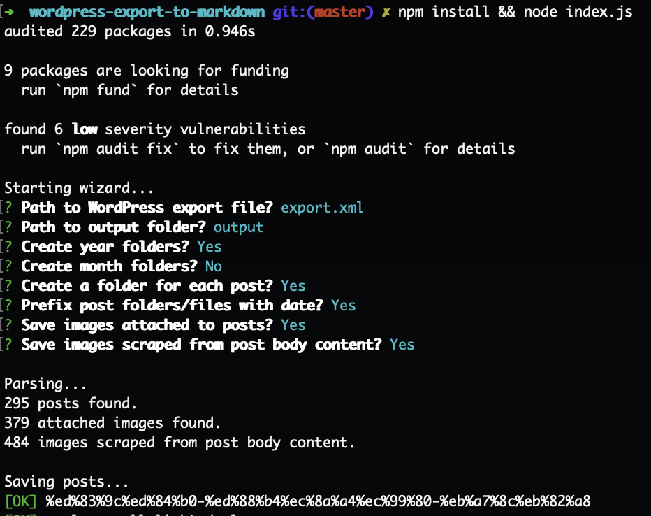
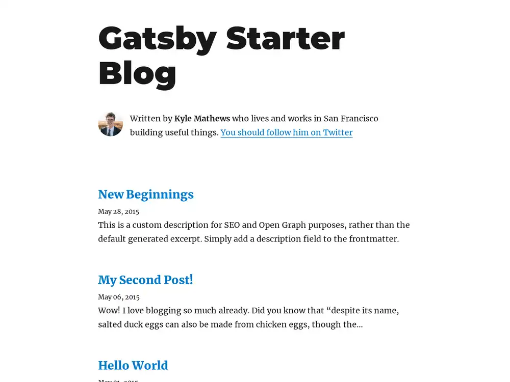
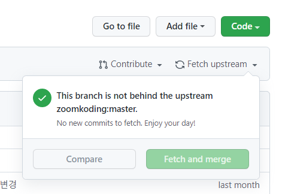

이미 얼마 전부터 블로그를 손봐야 겠다는 생각은 많이 했었습니다. 그동안 설치형 블로그를 많이 사용했었습니다. 블로그를 적극적으로 하는 스타일은 아니지만 그래도 꽤 오랫동안 다양하게 사용해 봤습니다.

## 블로그 짬밥

|     | 도구                                       | 형태  | 언어   | 특징                                                                                                                                                                                                                                    |
|-----|------------------------------------------|-----|------|---------------------------------------------------------------------------------------------------------------------------------------------------------------------------------------------------------------------------------------|
| 1   | 태터툴즈                                     | 설치형 | PHP  | 학부 시절 순수 PHP에 대한 재미로 국산 블로그 소프트웨어 설치하면서 시작                                                                                                                                                                                            |
| 2   | 티스토리                                     | 서비스 |      | 호스팅, DB 관리가 귀찮아서, 태터툴즈 DB를 티스토리 서비스로 마이그레이션                                                                                                                                                                                           |
| 3   | 워드프레스                                    | 설치형 | PHP  | 세계적으로 검증된 CMS 툴로서 설치형을 지원                                                                                                                                                                                                             |
| 4   | 워드프레스                                    | 서비스 |      | 호스팅, DB 관리가 귀찮아서~~역사의 반복~~, 워드프레스 서비스형으로 데이터 이관                                                                                                                                                                                       |
| 5   | [Hugo](https://gohugo.io/)               | 설치형 | Ruby | 정적 사이트 생성기라는 신선한 개념을 처음 알게되고 개별 포스트를 작성                                                                                                                                                                                               |
| 6   | [Jekyll](https://jekyllrb-ko.github.io/) | 설치형 | Ruby | Markdown 편집이라 개발자 친화적이며 호스팅 없이 gh-phage 활용 가능<br/>관련글: [Wordpress 블로그 Jekyll로 가져오기](https://gizrak.github.io/%EB%B8%94%EB%A1%9C%EA%B7%B8/Wordpress-%EB%B8%94%EB%A1%9C%EA%B7%B8-Jekyll%EB%A1%9C-%EA%B0%80%EC%A0%B8%EC%98%A4%EA%B8%B0/) |

Jekyll로 넘어가는 과정에서 MySQL DB에 있던 내용들을 모두 `.md` 파일로 변환하는 작업을 했습니다. 다행이 Wordpress를 Markdown으로 [변환해주는 툴](https://github.com/lonekorean/wordpress-export-to-markdown) 덕분에 쉽게 할 수 있었습니다. 그렇게 지금까지 사용했던 블로그 [https://gizrak.github.io/](https://gizrak.github.io/) 를 만들었습니다.



꽤 오랜기간 블로그라는걸 운영을 해왔지만 사실 한가지 근본적인 아쉬움은 있었습니다. 그냥 툴을 사용하는 입장에서 매뉴얼대로 설치하고 사용하는 것 뿐이었습니다. PHP와 Ruby가 전혀 어색한 언어는 아니었지만 굳이 깊이 파고들 만큼 열정이나 지식을 가지고 있지는 않았습니다. 쓰는 정도로만 충분했죠.

## Gatsby 블로그

그래서 최근에 눈여겨보던 플랫폼이 바로 [Gatsby](https://www.gatsbyjs.com/) 였습니다. 무엇보다 익숙한 자바스크립트 언어를 기반으로 했고, 리액트에서 파생된 CMS 플랫폼이었기 때문입니다. 공식 사이트에서 [gatsby-starter-blog](https://www.gatsbyjs.com/starters/gatsbyjs/gatsby-starter-blog) 를 제공해 주는데, 뭔가 책에서 나오는 샘플 예제 수준이라 이걸로 하기엔 좀 아쉬웠습니다.



### 줌코딩 블로그 템플릿

그러다 줌코딩 님이 개발하신 [gatsby-blog](https://github.com/zoomKoding/zoomkoding-gatsby-blog) 를 알게 되었습니다. 디자인과 구성이 깔끔하고 개발 블로그로 사용하기 안성맞춤이었습니다. 설치하는 방법은 2가지인데 저는 후자를 이용했습니다.

1. 공식 사이트에 있는 `Deploy to Netlify` 버튼을 이용
    - Netlify 연동해서 내 저장소에 `zoomkoding-gatsby-blog`를 내 저장소로 clone
    - 쉽고 간단하게 원클릭으로 설정이 가능
2. 공식 사이트 저장소를 Fork
    - 위 clone 방법과 동일한 이름의 내 저장소가 생성됨
    - 차이점은 `Fetch upstream`을 사용해서 필요할 때마다 업데이트를 받을 수 있음
      

예전에 Jekyll 사용하면서 한가지 깨닫게 된 사실인데, 그냥 `clone`하면 upstream 저장소에 변경하상을 추적하기 힘들다는 단점이 있었습니다. 그래서 처음에 1번으로 했다가 2번으로 바꿔서 다시 한번 받았습니다. 그렇게 새롭게 블로그를 시작하게 되었네요.

### 메타정보 변경

Markdown을 똑같이 사용하기 때문에 크게 변경해야 할 부분은 없으나 그래도 손은 갑니다. 기존 Jekyll 에서 사용하던 메타 정보는 아래와 같습니다.
```markdown
---
title: 자바스크립트는 모든 곳에 존재한다
category:
  - 도서
---
```

이걸 새롭게 바뀐 메타정보 형식으로 변경합니다. 줌코딩 님의 블로그에서는 emoji를 상단에 표기하는데 꽤나 마음에 들었습니다.
```markdown
---
emoji: 📚
title: 자바스크립트는 모든 곳에 존재한다
date: '2021-10-09 23:00:00'
author: TED
tags: javascript reading starter featured
categories: 도서
---
```

## 앞으로의 계획

새로운 블로그의 몇가지 원칙을 만들었습니다.
1. 경어체를 사용
2. 개인 일상은 자제
3. 기록 & 정보공유 목적

예전엔 블로그에 일상 같은 얘기들을 꽤 썼습니다. 그래서인지 제가 예전에 쓴건 독백에 가까운 반말체로 되어 있습니다. 
이제는 SNS가 그런 역할을 충분히 대신해 주고 있습니다. 대부분의 블로그는 정보 전달을 목적으로 하네요. 저도 바꿔야겠습니다. 

[TIL](https://github.com/gizrak/TIL) 도 작성하고 있긴한데, 이건 이미 잘 만들어진 글들을 스크랩하는 부분에 가깝습니다. 
여긴 내가 배운 것들을 재가공해서 유용한 정보를 공유하는 목적으로 쓰려고 합니다.

좋은 블로그 템플릿을 공유해주신 줌코딩 님께 감사의 말을 전합니다.
